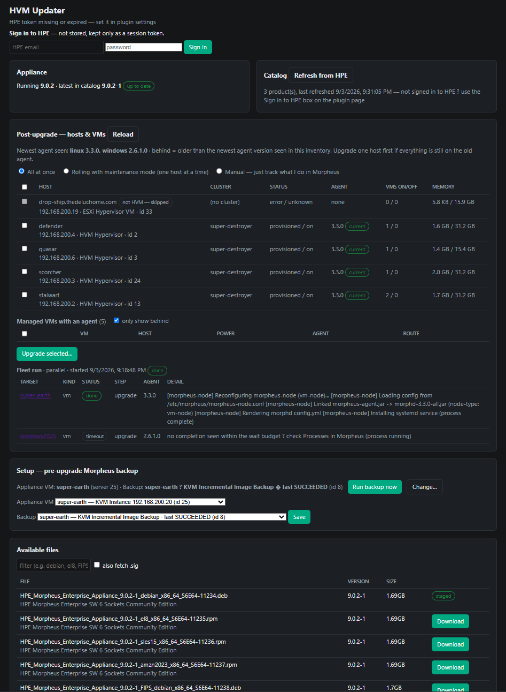
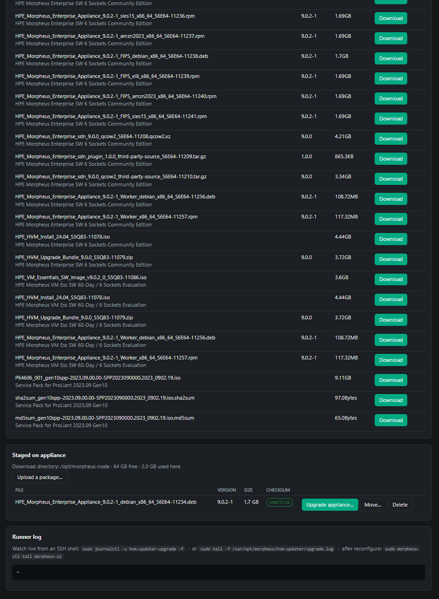
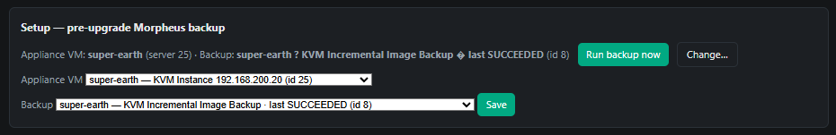
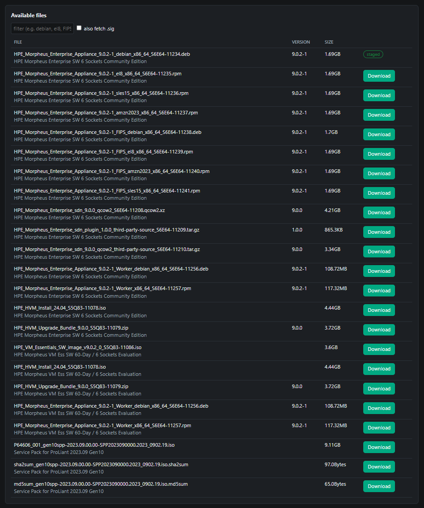
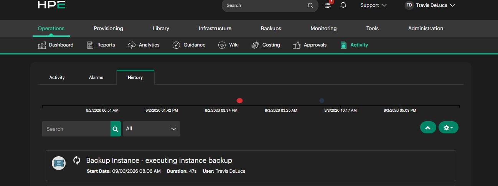
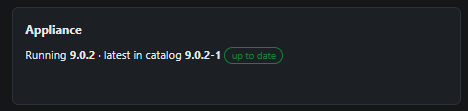
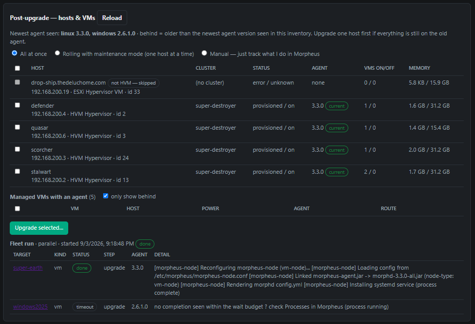
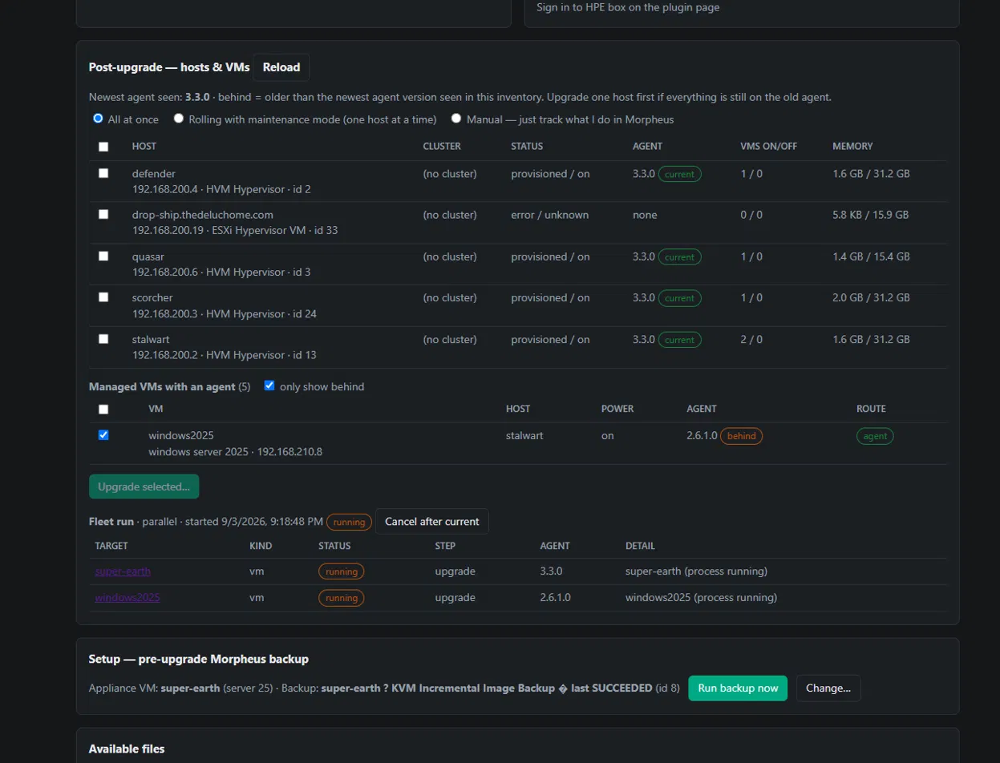
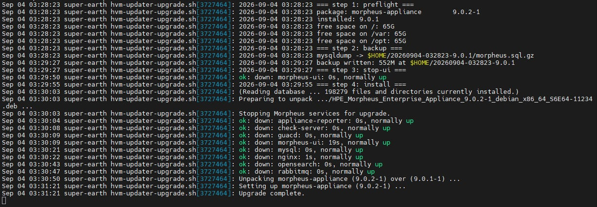

# hvm-updater

**Appliance and fleet updates for HPE Morpheus / HVM, driven from inside Morpheus.**

A Morpheus UI plugin that tracks releases in **My HPE Software Center**, downloads and SHA-512-verifies them onto the appliance, runs the appliance upgrade through a detached runner whose progress survives the UI restart, and then upgrades the Morpheus agent on your HVM hosts and VMs — all from one page at `https://<appliance>/plugin/hvmUpdater`.

First real run on a test appliance: **9.0.1 → 9.0.2 in 41 minutes end to end**, including a Morpheus VM backup of the appliance itself, with the runner journal readable throughout and the page resuming when the UI came back.

<!-- screenshot: full page after an upgrade — Appliance/Catalog cards, fleet card, Setup, Available files -->

<!-- screenshot: full page after an upgrade — Appliance/Catalog cards, fleet card, Setup, Available files -->



> **Status:** 0.9.x — working on a single-appliance install (self-managed appliance VM on an HVM cluster). Not yet exercised on HA / multi-node appliances or external databases. See [Known gaps](#known-gaps).

---

## Table of contents

- [What it does](#what-it-does)
- [How it works (short version)](#how-it-works-short-version)
- [Requirements](#requirements)
- [Install](#install)
- [Configure](#configure)
- [Upgrade the appliance](#upgrade-the-appliance)
- [Post-upgrade: hosts & VMs](#post-upgrade-hosts--vms)
- [Watching during the outage](#watching-during-the-outage)
- [Build from source](#build-from-source)
- [Documentation](#documentation)
- [Known gaps](#known-gaps)
- [License](#license)

---

## What it does

| Area | Summary |
|---|---|
| **Catalog** | Polls My HPE Software Center on a schedule, lists every product/file your account can download, flags when the catalog is newer than the running appliance. Sign in with HPE credentials on the page (Okta IDX replay, session-only) or paste a portal token. |
| **Downloads** | Background, resumable (`.part` + HTTP Range) downloads straight onto the appliance, SHA-512 checked against the portal listing. Only verified files can be used for an upgrade. Delete / move / storage view for the download directory. |
| **Appliance upgrade** | One click: Morpheus backup of the appliance VM (optional) → local DB/config backup → `morpheus-ctl stop morpheus-ui` → `dpkg -i` → `morpheus-ctl reconfigure` → wait for `/api/ping` → verify version. Runs as a **transient systemd unit** so stopping the UI doesn't kill it. |
| **Progress that survives the outage** | The runner writes `upgrade.json` + `upgrade.log` at every step. The page polls those; while the UI is down the browser keeps retrying; when it's back, the page shows where the run got to. Optional sinks: webhook, status-file mirror (NFS/CIFS), Morpheus notifications, `journalctl -f`. |
| **Post-upgrade fleet** | Upgrade the Morpheus agent on HVM hosts and managed VMs via the appliance API. **All at once**, **rolling with maintenance mode** (HA preflight → evacuate → optional powered-off relocate → upgrade → leave maintenance), or **manual tracking**. Per-target progress from `/api/processes`. |

## How it works (short version)

```
 Browser ──► /plugin/hvmUpdater ──► HvmUpdaterController (Groovy, inline page)
                                          │
        ┌─────────────────────────────────┼──────────────────────────────────┐
        ▼                                 ▼                                  ▼
   Catalog / SwcClient             TaskAgent                            MorpheusApi
   (HPE Software Center,      executeCommandOnServer()             (appliance /api, token)
    TokenManager, HpeLogin)   on the appliance ComputeServer:        backups, servers,
        │                     curl, sha512sum, systemd-run …          processes, clusters
        ▼                                 │                                  │
   catalog.json                           ▼                                  ▼
                              hvm-updater-upgrade.sh                    FleetService
                              transient systemd unit, root           parallel / rolling /
                              upgrade.json + upgrade.log             manual; fleet.json
```

No SSH from the plugin, no agent scripts, no Morpheus tasks: the plugin runs shell on the appliance through the same `executeCommandOnServer` path Morpheus uses for managed servers, and the one long-running piece (the upgrade) is handed to systemd. Details in [docs/architecture.md](docs/architecture.md).

## Requirements

- HPE Morpheus / HVM 8.0.x – 9.0.x appliance on Debian/Ubuntu (`.deb` packages). Tested on 9.0.1 → 9.0.2.
- The appliance must be a **managed server in its own inventory** (it is by default when Morpheus is a VM on an HVM cluster) with a sudo-capable command user.
- A **Morpheus API token** (user with admin rights) for `/api/*` calls.
- An **HPE Software Center** account entitled to the Morpheus/HVM downloads.
- Plugin permission: `admin-cm` (Administration → Plugins). Anyone who can open the page can upgrade the appliance.

## Install

1. Download `hvm-updater-<version>-all.jar` from [Releases](../../releases) (or [build it](#build-from-source)).
2. Morpheus → **Administration → Integrations → Plugins → Add**, upload the jar.
3. Open `https://<appliance>/plugin/hvmUpdater`. There is no nav link yet — bookmark it.

Upgrading the plugin: upload the new jar over the old one. A fleet run in progress is resumed by the new build; an appliance upgrade in progress is unaffected (it's a systemd unit).

## Configure

Administration → Integrations → Plugins → HVM Updater → settings. The essentials:

| Setting | What to put |
|---|---|
| **Appliance URL** / **Morpheus API token** | `https://127.0.0.1` and a token for an admin user. Needed for backups, fleet, and version checks. |
| **HPE token** | Optional. Paste `localStorage.authToken` from a signed-in Software Center tab, or leave blank and use **Sign in to HPE** on the page each session. |
| **Products** | Comma-separated `productNumber`s, blank = everything you're entitled to. |
| **Download directory** | Default `/var/opt/morpheus/hvm-updater/downloads`. `~`/`$HOME` are expanded; `/tmp` is warned against (tmpfs). |
| **Wait for UI** / **Backup wait** | Minutes the runner waits for `/api/ping` after reconfigure (25) and the plugin waits for the Morpheus backup (90). |

Then on the page, **Setup — pre-upgrade Morpheus backup**: pick the appliance VM and one of its backup jobs. The full list with the optional sinks is in [docs/settings.md](docs/settings.md).

<!-- screenshot: plugin settings dialog (Administration → Plugins → HVM Updater) with tokens blanked -->


<!-- screenshot: the Setup card with an appliance VM and backup job chosen -->


Quick health check: `https://<appliance>/plugin/hvmUpdater/api/diag?probe=1` should show the credential resolving and the command probe succeeding (`sudo -n true` on the appliance).

## Upgrade the appliance

1. **Refresh from HPE** — the Appliance card says *update available* when the catalog is newer.
2. **Download** the Debian `.deb` (filter box: `debian`). Ends with `sha512 ok` and a *staged* pill.

   <!-- screenshot: Available files list with a download in progress and one file marked staged -->
   
3. **Upgrade appliance…** → confirm. Steps:

   `morpheus-backup → preflight → backup → stop-ui → install → reconfigure → wait-ui → done`

   The first step is the plugin executing your Morpheus backup job and waiting for a new successful result. Everything after that is the runner. The UI drops at `stop-ui` (typically 15–30 min out on 9.0.x — `reconfigure` alone is ~10 min of Chef); the page keeps polling and picks up at `wait-ui`/`done`.
   <!-- screenshot: Backup task running and showing in Morpheus History -->
   

   <!-- screenshot: Upgrade card mid-run (step bar at reconfigure, runner log tail) -->
   
4. Afterwards, the Upgrade card, `upgrade.log`, and `journalctl -u hvm-updater-upgrade` should agree, and the Appliance card shows the new version.

   <!-- screenshot: Upgrade card at done, from → to versions, Appliance card showing 'up to date' -->
   

Runner internals, the recovery path when `reconfigure` fails, and the backup layout are in [docs/upgrade-runner.md](docs/upgrade-runner.md).

## Post-upgrade: hosts & VMs

After the appliance is on the new version its agents are usually behind. The **Post-upgrade — hosts & VMs** card lists HVM hosts by cluster and managed VMs with an agent, shows each one's agent version against the newest seen per platform (Linux vs Windows are separate lines), and which **route** Morpheus will use (live agent, saved SSH credentials, or none).

Pick targets, pick a mode, **Upgrade selected…**:

<!-- screenshot: Post-upgrade card — hosts grouped by cluster, VMs with route column, mode radios -->


- **All at once** — identical to *select all → Upgrade Agent* on the Hosts page (`PUT /api/servers/{id}/upgrade` per target).
- **Rolling with maintenance mode** — hosts one at a time: HA preflight (peers online, their free memory ≥ this host's running-VM memory, 3-node quorum warning) → enter maintenance (Morpheus live-migrates running VMs; the run waits until none remain) → optionally relocate powered-off VMs → upgrade → wait → leave maintenance. A failure stops the run and **leaves the host in maintenance** for you to inspect.
- **Manual** — nothing executed; the rows track what you do in Morpheus.

Each row shows status, step, agent before → after, and the last process message. Targets that produce no process and no version change in 4 minutes are marked *stalled* — that's the "no route to guest" case Morpheus fails after ~3 minutes with `Unable to determine distro`. See [docs/fleet.md](docs/fleet.md).

<!-- screenshot: Fleet run table with one target done (agent before → after, process message) and one running -->


## Watching during the outage

While `morpheus-ui` is stopped the page can't reach the plugin. Options, all optional and configurable:

```bash
sudo journalctl -u hvm-updater-upgrade -f          # live runner output
sudo tail -f /var/opt/morpheus/hvm-updater/upgrade.log
```

- **Progress webhook** — POSTs the status JSON at every step (Slack/Teams/n8n…).
- **Mirror status file** — copies `upgrade.json` to an NFS/CIFS path you can watch from outside.
- **Morpheus notifications** — start/finish only (the API is down in between).

<!-- screenshot: terminal with journalctl -u hvm-updater-upgrade -f during reconfigure -->


## Build from source

```bash
./gradlew clean shadowJar            # JDK 17; Groovy 3.0.13; morpheus-plugin-api 1.3.3
ls build/libs/hvm-updater-*-all.jar
```

Source is UTF-8 and the build forces that encoding — a Windows JDK with a cp1252 default will still produce correct output.

## Documentation

| Doc | Contents |
|---|---|
| [docs/architecture.md](docs/architecture.md) | Components, data flow, files on disk, why systemd-run, threading and persistence. |
| [docs/upgrade-runner.md](docs/upgrade-runner.md) | `hvm-updater-upgrade.sh` step by step, env file, state JSON, recovery, backups. |
| [docs/fleet.md](docs/fleet.md) | Post-upgrade host/VM agent upgrades: inventory rules, modes, preflight, stall detection. |
| [docs/hpe-software-center.md](docs/hpe-software-center.md) | Portal API map, token handling, Okta IDX login replay, the standalone `hpe_swc.py`. |
| [docs/settings.md](docs/settings.md) | Every plugin setting and page setup field. |
| [docs/api.md](docs/api.md) | The plugin's own HTTP endpoints under `/plugin/hvmUpdater/api/*`. |
| [docs/troubleshooting.md](docs/troubleshooting.md) | Symptoms → causes → fixes, gathered from real runs. |
| [CHANGELOG.md](CHANGELOG.md) | Per-version history. |

## Known gaps

- **Remote targets.** The command target is configurable but packages are downloaded to the local appliance's directory; upgrading a *different* appliance needs the `.deb` pushed there first.
- **HA appliances / external DB.** The runner does `mysqldump` of the embedded MySQL and assumes a single `morpheus-ui`; an external DB is skipped with a log line, multi-node is untested.
- **No nav entry.** Bookmark `/plugin/hvmUpdater`.
- **Rolling relocate of powered-off VMs** uses `PUT /api/servers/{id}/placement` with an educated-guess body; errors are recorded per VM and the run continues. Leave the checkbox off until it's confirmed on your build.
- **Cluster/process field names** vary a little across Morpheus builds. `/api/fleet/probe?serverId=N` dumps what this build returns so mappings can be adjusted.
- **HPE portal terms.** Check My HPE Software Center terms of use before distributing anything that automates it.

## License

[MIT](LICENSE). Not affiliated with or endorsed by HPE.
